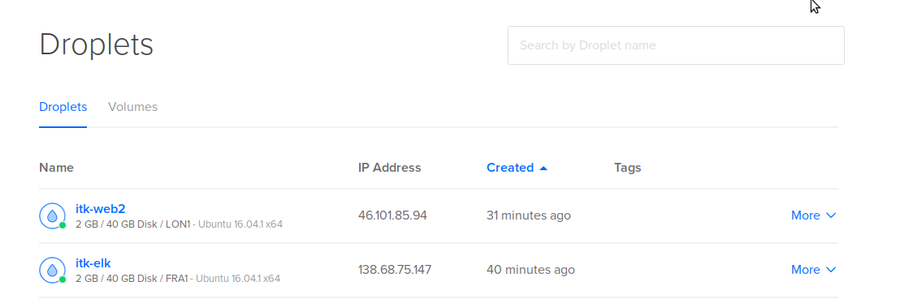
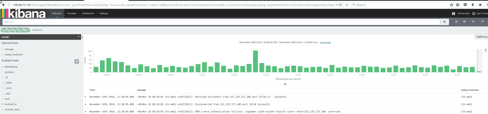
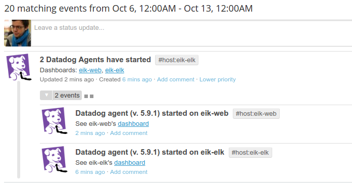
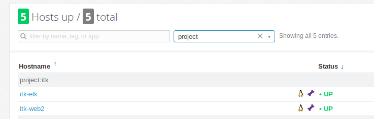
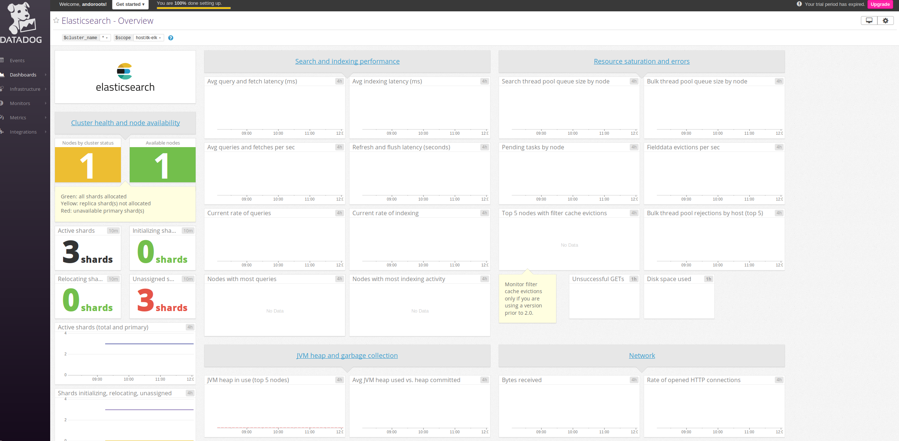
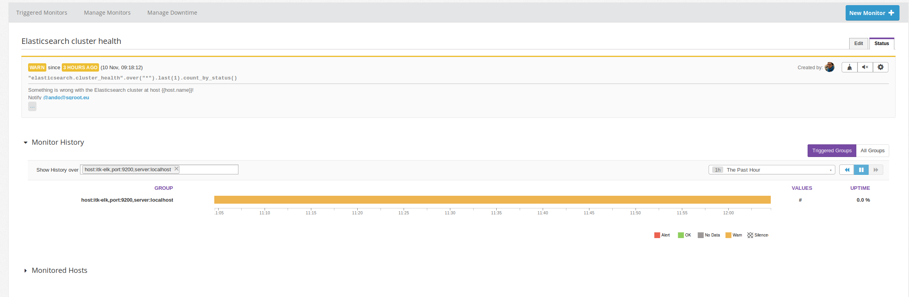

# Logging

College lab assignment about logging and monitoring.

## Assignment

- Install the ELK stack on server `eik-elk`
- Install a web server on server `eik-web`
- Have the web server log its error and access logs to ELK
- Have both servers send their syslog to ELK
- Install Datadog agent on both servers, which monitors the server and ELK

Following is a set of instructions for solving the Assignment. Server install and configuration is automated via Ansible.

### ELK stack for log storage and search

The ELK stack consists of Elasticsearch, Logstash, and Kibana. Elasticsearch is a database engine. Logstash is a tool for log data intake, processing, and output. Kibana is used to visualize and search logs.

### Datadog for monitoring

Datadog is a cloud-based monitoring solution. It allows the operators to monitor, graph, search and alert on large volumes of time-series data.

#### Advantages

- hosted service (minimal administrative costs)
- extremely easy and versatile agent installation (one Bash command or Ansible role)
- dozens of ready-to-use integrations, for example Elasticsearch
- ability to work with custom metrics and API
- suitable for both small and large volumes of data
- easy to use and powerful UI

#### Disadvantages

- paid service
- closed-source server
- requires Python

Datadog was chosen over older monitoring solutions such as Nagios or Zabbix because it is much easier to operate and configure and is more suitable for monitoring larger, distributed and dynamic server infrastructure.

## Provisioning

- Provision two new VMs in DigitalOcean (4GB RAM, Ubuntu 16.04)



- Install Python 2.7 to both servers via SSH (prerequisite for Ansible, must be installed manually)

```bash
ssh root@server-ip apt-get install -y python
```

We now have two fresh Linux servers with default settings and Python installed.

## Running Ansible

Ansible will be SSH-ing into the servers and installing and configuring ELK, the web server and logging automatically.

Install required 3rd party Ansible roles:

```bash
ansible-galaxy install -r requirements.yml --force -p roles 
```

Edit the `hosts` file in this project and enter the IP addresses of the new servers.

Log into Datadog, grab your API key, export Datadog key and run Ansible:

```bash
DD_API_KEY='xxx' ansible-playbook -i hosts site.yml
```

After Ansible completes, the servers should be installed and configured. Enter the IP of the ELK server and port `5601` to a browser to see the Kibana interface.



Kibana can be used to search logs. Enter the IP address of the web server to the browser to see a static web site hosted by Apache2. The access logs from that server should be visible in Kibana.

## Monitoring

Ansible should have installed Datadog agents to both servers. They should be visible from Datadog.




Clicking on the "elasticsearch" tag behind the ELK server should open a dashboard with Elasticsearch monitoring data.



The dashboard is mostly empty if the server was started just moments ago.

We can configure e-mail alerts from under "Monitors" that will alert the operator if the Elasticsearch server experiences issues.



## Links

- https://www.digitalocean.com/community/tutorials/how-to-install-and-configure-elasticsearch-on-ubuntu-16-04
- https://docs.ansible.com/
- https://datadoghq.com